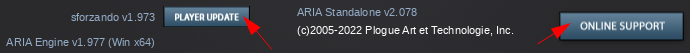
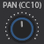
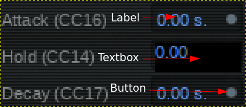
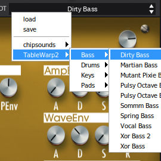
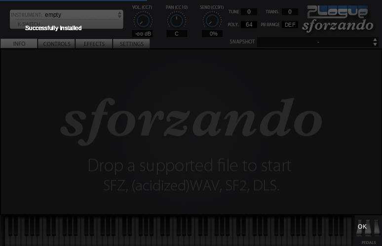
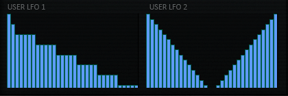
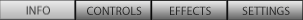

# Widgets

## Regular

### CommandButton

A button executing a command when pushed.
The background image is composed vertically of 2 frames, one for each button state.



```xml
<CommandButton command="launch_url" data0="https://www.plogue.com/help.html"
  image="btn_help.png" x="600" y="280" w="134" h="38" transparent="1"
/>
```

| Name          | Type   | Description / Value(s)
| ---           | ---    | ---
| x / y / w / h | int    | coordinates and size
| command       | string | a command, see table below
| data0         | string | if present, specify a command parameter or URL
| data1         | string | if present, specify a dialog window title
| image         | string | an image file name (2 vertical frames button)
| inverted      | int    | if 1, the pushed / released image frames are read in reverse

Some of possible commands:

| Command name  | Description / Value(s)
| ---           | ---
| edit          |
| launch_url    | value in `data0`
| license       | or `license_NNNN`

### Keyboard

A piano keyboard.


```xml
<Keyboard param="DID_KEYBOARDGUI" x="10" y="435" w="702" h="64"
  start_key="0" end_key="108"
  offset0="8" offset1="30" offset2="41" offset3="63" offset4="74" offset5="85"
  image="keyboard/skinTRANS1.png"
  image2="keyboard/skin4.png"
  image3="keyboard/dark50.png"
  image4="keyboard/blue50.png"
/>
```

| Name          | Type   | Description / Value(s)
| ---           | ---    | ---
| x / y / w / h | int    | coordinates and size
| image         | string | filename for the enabled white keys when pressed and unpressed
| image2        | string | filename for the enabled black keys when pressed and unpressed
| image3        | string | filename for the shadow overlaid on the disabled keys
| image4        | string | filename for the shadow overlaid on the key switches
| offsetN       | int    | with N = 0 to 5, 6 in total TODO
| param         | int    | numeric, possibly CC, or named id e.g.: 10 or DID_SOMETHING
| start_key     | int    | first note key, e.g.: 0
| end_key       | int    | last  note key, e.g.: 108

### Knob

Rotary controller, using a vertical multi frame image.



```xml
<Knob param="10" x="333" y="17"
  image="knob_128.png" frames="128" vdefault="0.5"
/>
```

| Name     | Type   | Description / Value(s)
| ---      | ---    | ---
| x / y    | int    | coordinates
| eslot    | int    | TODO: can be empty
| frames   | int    | number of image frames
| image    | string | the name of the image file (vertical frame images)
| inverse  | int    | if 1, the image frames are read in reverse
| param    | int    | numeric, possibly CC, or named id e.g.: 10 or DID_SOMETHING
| vdefault | float  | the default value

### Label

A text label to display some value set from another control,
associated with the same `param`.

```xml
<Label param="10" x="333" y="59" w="50" h="18" format="FORMAT_STEREOPAN"
  vdefault="0.5" transparent="1" alignment="center" color_text="#FFFFFFFF"
/>
```

| Name          | Type   | Description / Value(s)
| ---           | ---    | ---
| x / y / w / h | int    | coordinates and size
| alignment     | enum   | left / center / right, the text alignment inside the rect
| color_text    | RGBA   | text color
| factor        | int    | number to be multiplied with the float, 0 to 1 value
| format        | string | `printf` format string or predefined (e.g.: FORMAT_LINEAR2DB / FORMAT_STEREOPAN)
| param         | int    | numeric, possibly CC, or named id e.g.: 10 or DID_SOMETHING
| transparent   | int    | if 1, use a transparent background
| vdefault      | float  | the default value

### DragLabel

A label that displays a value that can be changed by clicking and moving the mouse
over it; up and down or left and right.


```xml
<DragLabel param="3" eslot="" x="125" y="302" w="60" h="18"
  format="%5.f Hz" offset="0.02325"   vdefault="0.713" factor="21500"
  transparent="1"  alignment="center" color_text="#5f9cf8ff"
/>
```

| Name          | Type   | Description / Value(s)
| ---           | ---    | ---
| x / y / w / h | int    | coordinates and size
| alignment     | enum   | left / center / right, the text alignment inside the rect
| color_text    | RGBA   | text color
| factor        | int    | number to be multiplied with the float, 0 to 1 value
| format        | string | printf format string / FORMAT_LINEAR2DB / FORMAT_STEREOPAN
| offset        | int    | value offset
| param         | int    | numeric, possibly CC, or named id e.g.: 10 or DID_SOMETHING
| transparent   | int    | if 1, use a transparent background
| vdefault      | float  | the default value

### NumericTextBox

A composite widget with a DragLabel on the left and a button on the right.
When the button is pressed, a textbox appears to permit to digit the value to set.



```xml
<NumericTextBox param="1" x="126" y="96" w="55" h="18"
  format="%4.f ct." offset="0"      factor="1200"
  alignment="left"  transparent="1" color_text="#5f9cf8ff"
/>
```

| Name          | Type   | Description / Value(s)
| ---           | ---    | ---
| x / y / w / h | int    | coordinates and size
| alignment     | enum   | left / center / right, the text alignment inside the rect
| color_text    | RGBA   | text color
| factor        | int    | number to be multiplied with the float, 0 to 1 value
| format        | string | printf format string / FORMAT_LINEAR2DB / FORMAT_STEREOPAN
| offset        | int    | value offset
| param         | int    | numeric, possibly CC, or named id e.g.: 10 or DID_SOMETHING
| transparent   | int    | if 1, use a transparent background

### OnOffButton

A switch button, using a 2 frames image like [CommandButton](#commandbutton).

```xml
<OnOffButton image="keyboard/pedal_l.png" param="67"
  x="720" y="445" w="14" h="35"
/>
```

| Name          | Type   | Description / Value(s)
| ---           | ---    | ---
| x / y / w / h | int    | coordinates and size
| image         | string | the name of the image file
| inverse       | int    | if 1, the on / off image frames are read in reverse
| param         | int    | numeric, possibly CC, or named id e.g.: 10 or DID_SOMETHING

### OptionMenu

A LMB / RMB clickable label area to display a menu.


```xml
<OptionMenu param="DID_SLOTPOLY" x="488" y="43" w="33" h="12"
  font_size="normal" transparent="1" alignment="center" color_text="#FFFFFFFF"
  vdefault="64"
>
  <OptionItem name="-GPolyphony" value="0" />
  <OptionItem name="1"   value="1" />
  <OptionItem name="2"   value="2" />
  <OptionItem name="8"   value="8" />
  <OptionItem name="16"  value="16" />
  <OptionItem name="32"  value="32" />
  <OptionItem name="64"  value="64" />
  <OptionItem name="128" value="128" />
</OptionMenu>
```

| Name          | Type  | Description / Value(s)
| ---           | ---   | ---
| x / y / w / h | int   | coordinates and size
| alignment     | enum  | left / center / right, the text alignment inside the rect
| color_text    | RGBA  | e.g.: "#D7DAE0FF"
| font_size     | enum  | verysmall / small / normal / big / verybig
| param         | int   | numeric, possibly CC, or named id e.g.: 10 or DID_SOMETHING
| transparent   | int   | if 1, use a transparent background
| vdefault      | float | the default value

#### OptionItem

OptionMenu item.

| Name  | Type   | Description / Value(s)
| ---   | ---    | ---
| name  | string | the menuitem label
| value | float  | the value associated e.g.: 0.5678

### `<PrefixName>`Menu

Similar to `OptionMenu` above, without items specified in XML.<br>
`PrefixName` varies, e.g.: `FileMenu`/`KSMenu`/`OutputMenu`/`PresetMenu`.<br>
When `image_{previous|next}` are present, the menu items can be changed by
pressing over the relative image, usually up and down buttons like in a spinner
widget.



```xml
<FileMenu param="DID_FILENAME" x="90" y="20" w="157" h="19"
  color_text="#000000ff"  font_size="normal" transparent="1"
  image_next="next_v.png" image_previous="previous_v.png"
  alignment="left"        image_vertical_align="1"
/>
```

| Name                 | Type   | Description / Value(s)
| ---                  | ---    | ---
| x / y / w / h        | int    | coordinates and size
| alignment            | enum   | left / center / right, the text alignment inside the rect
| color_text           | RGBA   | text color
| entry_empty          | int    | TODO: might be int like `transparent`
| entry_import         | int    | TODO: might be int like `transparent`
| entry_reload         | int    | TODO: might be int like `transparent`
| entry_saveasdefault  | int    | TODO: might be int like `transparent`
| eslot                | int    | TODO
| font_size            | enum   | verysmall / small / normal / big / verybig
| image_next           | string | arrow image filename
| image_previous       | string | arrow image filename
| image_vertical_align | int    | if 1, the images are aligned vertically
| param                | int    | numeric, possibly CC, or named id e.g.: 10 or DID_SOMETHING
| target               | URL    | TODO: some effect URL, e.g.: "com.Vendor.Effectname"
| transparent          | int    | if 1, use a transparent background
| type                 | URL    | TODO: same as target

### PopupOverlay

Overlay widget, usually a transparent panel over the full client size
of the application window with an OK label at the bottom right.
Used to display some messages, such as after registering a new ARIA instrument.
Can be closed by clicking on it.



```xml
<PopupOverlay x="0" y="0" w="870" h="460" color_back="#00000060" />
```

| Name          | Type  | Description / Value(s)
| ---           | ---   | ---
| x / y / w / h | int   | coordinates and size
| color_back    | RGBA  | background color (e.g.: #00000060)

### ProgressBar

Used to view the loading progress of a sampled instrument.

```xml
<ProgressBar x="27" y="33" w="836" h="2" image="pb.png" />
```

| Name          | Type   | Description / Value(s)
| ---           | ---    | ---
| x / y / w / h | int    | coordinates and size
| image         | string | image filename for a 2 frames progress bar
|               |        | TODO: empty and full? Verify this

### Rect

A drawn rectangle.

```xml
<Rect x="0" y="1" w="775" h="3"
  fill_color="#5e5e5e88" drawMode="filled" frameWidth="0"
/>
```

| Name          | Type  | Description / Value(s)
| ---           | ---   | ---
| x / y / w / h | int   | coordinates and size
| drawMode      | enum  | filled / stroked
| fill_color    | RGBA  | fill color
| frameWidth    | int   | TODO

### Slider

Same purpose as a [Knob](#knob), but with a linear, horizontal or vertical groove
and a movable handle.


```xml
<Slider param="7" x="10" y="142" w="28" h="200" orientation="vertical"
  image_handle="fader.png" image_bg="backer_fader.png"
/>
```

| Name          | Type   | Description / Value(s)
| ---           | ---    | ---
| x / y / w / h | int    | coordinates and size
| image_bg      | string | the name of the image file (slider trail)
| image_handle  | string | the name of the image file (slider handle)
| orientation   | enum   | horizontal / vertical
| param         | int    | numeric, possibly CC, or named id e.g.: 10 or DID_SOMETHING

### SpecialDigitKnob

A clickable label that changes its value when keeping pressed the LMB and moving
the mouse: down/left to decrease or up/right to increase its value.
Value can be positive or negative.


```xml
<SpecialDigitKnob param="DID_SLOTTUNING" x="488" y="16" h="15" w="33"
  image="numbers_0-9_07.png" minus_image="neg.png" plus_image="pos.png"
  nbh="15" nbw="7" vmin="-100" vmax="100" digit_min="-100" digit_max="100"
  base="0" numbers="3" granularity="1" show_leading_zeros="0" alignment="center"
/>
```

| Name               | Type   | Description / Value(s)
| ---                | ---    | ---
| x / y / w / h      | int    | coordinates and size
| alignment          | enum   | left / center / right, the text alignment inside the rect
| base               | int    | TODO
| digit_max          | int    | maximum value, e.g.: "100"  TODO: what's the difference with vmax?
| digit_min          | int    | minimum value, e.g.: "-100" TODO: what's the difference with vmin?
| granularity        | int    | changing value steps
| image              | string | filename of the image used for the numeric values
| minus_image        | string | filename of the image used as minus for negative values
| plus_image         | string | filename of the image used as plus  for positive values
| nbh                | int    | the number image height
| nbw                | int    | the number image width
| numbers            | int    | value size, e.g.: 2 for 0-99 or 3 for 0-100
| param              | int    | numeric, possibly CC, or named id e.g.: 10 or DID_SOMETHING
| show_leading_zeros | int    | whether to show leading 0s, e.g.: 000 to 100
| vmax               | int    | maximum value, e.g.: "100"
| vmin               | int    | minimum value, e.g.: "-100"

### Splash

TODO: might be a splashscreen window

```xml
<Splash x="0" y="0" w="774" h="470" image="SplashBG.png" />
```

| Name          | Type   | Description / Value(s)
| ---           | ---    | ---
| x / y / w / h | int    | coordinates and size
| image         | string | the filename of the background image
| url           | string | URL TODO: probably open in browser on image click

### StaticImage

```xml
<StaticImage x="0" y="0" w="775" h="335" image="aria_info_sfz.png" />
```

| Name          | Type   | Description / Value(s)
| ---           | ---    | ---
| x / y / w / h | int    | coordinates and size
| image         | string | the name of the image file
| transparent   | int    | if 1, use a transparent background

### StaticText

Non variable [Label](#label) like control

```xml
<StaticText text="FX Type :" x="25" y="20" w="50" h="18"
  color_text="#a3a3a4FF" alignment="center"
/>
```

| Name          | Type   | Description / Value(s)
| ---           | ---    | ---
| x / y / w / h | int    | coordinates and size
| alignment     | enum   | left / center / right, the text alignment inside the rect
| color_back    | RGBA   | background color
| color_border  | RGBA   | border color
| color_text    | RGBA   | text color
| font_size     | enum   | verysmall / small / normal / big / verybig
| text          | string | label displayed text
| transparent   | int    | if 1, use a transparent background

### StepEditor

Composed of a specified number of vertical bars, each of which represents the value of a single step;
might be used as curve editor.



```xml
<StepEditor target="com.Plogue.Aria.LFO.user1" param="9876"
  x="216" y="241" w="193" h="112" voffset="10" hoffset="10"
  vmin="0" vmax="15" step_increment="1" nbstep="32"
  border_color="#005B4AFF" fill_color="#5e9bf7ff" zero_color="#004B3AFF"
  editor_border_color="#000000FF" transparent="1" image="bg_black.png"
/>
```

| Name                | Type   | Description / Value(s)
| ---                 | ---    | ---
| x / y / w / h       | int    | coordinates and size
| border_color        | RGBA   | bars border color
| editor_border_color | RGBA   | editor border color
| fill_color          | RGBA   | bars color
| zero_color          | RGBA   | TODO
| image               | string | the relative path to the background image file
| hoffset             | int    | TODO: might be border / margin / padding value
| voffset             | int    | TODO: might be border / margin / padding value
| nbstep              | int    | bars count
| param               | int    | numeric, possibly CC, or named id e.g.: 10 or DID_SOMETHING
| step_increment      | int    | step increment
| target              | URL    | TODO: some effect URL, e.g.: "com.Vendor.Effectname"
| transparent         | int    | if 1, use a transparent background
| vmax                | int    | maximum value, e.g.: "15"
| vmin                | int    | minimum value, e.g.: "0"

## Containers

### GUI

One or more gui file(s) are usually located in a `GUI` directory for any product type,
instrument or application. Contains the various widgets definitions.

`GUI/aria_info.xml`:

```xml
<!--
  It's a GUI file, describing an (opaque?) image with a rectangle area
  of 775x330 size inside a 787x335 container area.
-->
<GUI w="787" h="335"  >
  <StaticImage  x="0" y="0" w="775" h="330" image="Infotab.png"/>
</GUI>
```

1st instrument set, `GUI/01-Kitchen-X.xml`:

```xml
<!--
  Like above, but having also the GUI controls for CCs and the like over
  a transparent (?) background image.
-->
<GUI w="775" h="335">
  <StaticImage x="0" y="0" w="775" h="330" image="Control.png" transparent="1"/>

  <!-- Other GUI widgets follows here (Sliders) -->
</GUI>
```

The GUI node accepts the following parameters:

| Name                    | Type    | Description / Values
| ---                     | ---     | ---
| w / h                   | int     | size
| generic_h / generic_w   | int     | TODO
| generic_s               | int     | TODO
| DrawingBoundaries       | int     | TODO
| color_back              | RGBA    | background color
| color_border            | RGBA    | border color
| color_DrawingBoundaries | RGBA    | TODO
| color_text              | RGBA    | text color
| font_size               | enum    | verysmall / small / normal / big / verybig
| idleThrottle            | int     | TODO
| image                   | string  | background image filename

### GUIContainer

An abstract class / layout to contain GUI pages,
used in [TabView](#tabview) Panes.

```xml
<GUIContainer path="gui_settings.xml"/>
```

| Name         | Type   | Description / Value(s)
| ---          | ---    | ---
| eslot        | int    | TODO
| param        | int    | numeric, possibly CC, or named id e.g.: 10 or DID_SOMETHING
| param_offset | int    | TODO
| path         | string | xml filename of the contained GUI or define macro *ID
| slot         | int    | TODO
| xoffset      | int    | TODO: might be border / margin / padding value
| yoffset      | int    | TODO: might be border / margin / padding value

### TabView

Tabbed control, with Panes as pages.



```xml
<TabView id="controls" x="0" y="78" w="774" h="356"
  color_selected="#FFD800FF" color_deselected="#FFFFFFFF"
  image="btn_controls.png" position="top" alignment="left"
>
    <Pane image="aria_info_default.png" imageb="btn_info.png">
        <GUIContainer path="*ARIA_INFO"/>
    </Pane>
    <Pane image="" imageb="btn_controls.png">
        <GUIContainer param="DID_FILENAME" path="*ARIA_CONTROLS"/>
    </Pane>
    <Pane image="" imageb="btn_FX.png">
        <GUIContainer eslot="0" param="DID_EFILENAME" path="*ARIA_EFFECTS"
          xoffset="0" yoffset="0"
        />
        <StaticText text="FX Type :" x="25" y="20" w="50" h="18"
          color_text="#a3a3a4FF" alignment="center"
        />
        <FileMenu eslot="0" param="DID_EFILENAME" x="81" y="20" w="108" h="18"
          color_text="#FFFFFFFF" transparent="0" alignment="center"
          entry_empty="0" entry_reload="0" entry_import="0"
          image_next="next_8px.png" image_previous="previous_8px.png"
        />
    </Pane>
    <Pane image="" imageb="btn_settings.png">
        <GUIContainer path="gui_settings.xml"/>
    </Pane>
</TabView>
```

| Name             | Type   | Description / Value(s)
| ---              | ---    | ---
| x / y / w / h    | int    | coordinates and size
| alignment        | enum   | tab buttons alignment: left / center / right
| color_deselected | RGBA   | TODO
| color_selected   | RGBA   | TODO
| id               | string | the control id
| image            | string | image filename of the button background (2 frames: clicked and released)
| position         | enum   | tab buttons position: top / bottom / left / right

#### Pane

TabView' page pane.

| Name   | Type  | Description / Value(s)
| ---    | ---   | ---
| image  | image | relative path to the pane   background image file, optional
| imageb | image | relative path to the button background image file; 2 frames: clicked and released
